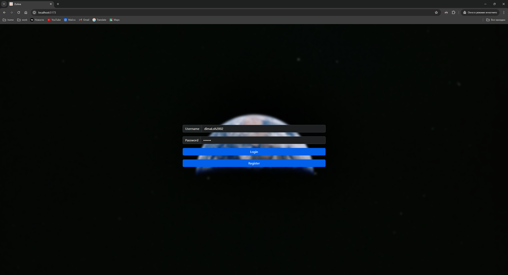
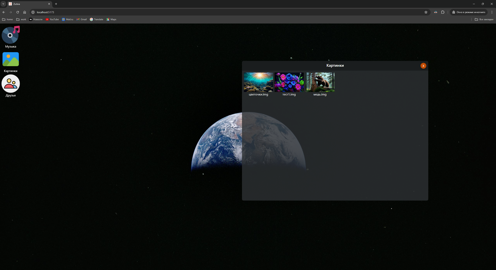

## Zutina-Desktop

Zutina-Desktop is an application for chatting with friends in a desktop environment Gnome style

### Stack:

- tRCP
- React
- Turborepo
- Docker

### Run

```bash
https://github.com/Zubenko-Company/zutina-desktop.git
```

```bash
pnpm i
```

```bash
pnpm start
```

<p float="left">
  
  
</p>
